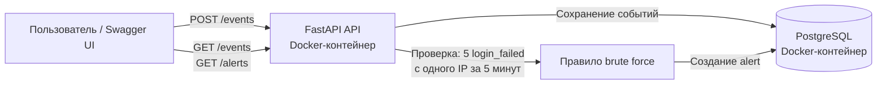

# Mini SIEM

Учебный сервис для приёма, хранения и анализа событий информационной безопасности.

Проект реализует упрощённую SIEM-логику: принимает события авторизации, сохраняет их в PostgreSQL и создаёт alert при признаках brute force-атаки.

## Возможности

- Приём событий через `POST /events`
- Валидация IP-адресов и входящих данных через Pydantic
- Хранение событий в PostgreSQL
- Просмотр событий через `GET /events`
- Фильтрация событий по IP-адресу и типу
- Правило обнаружения brute force:
  - 5 и более `login_failed`
  - с одного IP-адреса
  - за последние 5 минут
- Создание alerts уровня `high`
- Просмотр alerts через `GET /alerts`
- Запуск FastAPI и PostgreSQL в Docker Compose
- Автоматические тесты через `pytest`

## Технологии

- Python 3.12
- FastAPI
- Pydantic
- SQLAlchemy
- Psycopg
- PostgreSQL 16
- Docker и Docker Compose

## Схема работы



## Структура проекта

```text
mini-siem/
├── main.py                 # API-эндпоинты FastAPI
├── database.py             # Подключение к базе данных
├── models.py               # SQLAlchemy-модели таблиц
├── init_db.py              # Создание таблиц
├── docker-compose.yml      # Запуск API и PostgreSQL
├── Dockerfile              # Сборка контейнера API
├── requirements.txt        # Основные зависимости Python
├── requirements-dev.txt    # Зависимости для тестирования
└── README.md
```

## Запуск через Docker

```bash
docker compose up --build
```

После запуска Swagger UI доступен по адресу:

```text
http://127.0.0.1:8000/docs
```

Для запуска в фоне:

```bash
docker compose up -d --build
```

Для остановки контейнеров:

```bash
docker compose down
```

## API

### Проверка работы API

```text
GET /health
```

Пример ответа:

```json
{
  "status": "ok"
}
```

### Создание события

```text
POST /events
```

Пример запроса:

```json
{
  "source_ip": "203.0.113.10",
  "event_type": "login_failed",
  "message": "Неудачная попытка входа"
}
```

### Получение событий

```text
GET /events
```

Фильтрация по IP:

```text
GET /events?source_ip=203.0.113.10
```

Фильтрация по типу:

```text
GET /events?event_type=login_failed
```

### Получение alerts

```text
GET /alerts
```

Пример alert:

```json
{
  "id": "00000000-0000-0000-0000-000000000000",
  "source_ip": "203.0.113.10",
  "rule_name": "possible_brute_force",
  "severity": "high",
  "message": "За 5 минут получено 5 неудачных попыток входа.",
  "created_at": "2026-07-14T17:34:37.397904Z"
}
```

## Логика brute force

При каждом событии типа `login_failed` сервис:

1. Сохраняет событие в таблицу `events`.
2. Считает неудачные попытки входа с того же IP за последние 5 минут.
3. Если попыток 5 или больше — создаёт alert `possible_brute_force`.
4. Проверяет, что alert по этому IP уже не создавался в текущем временном окне.

